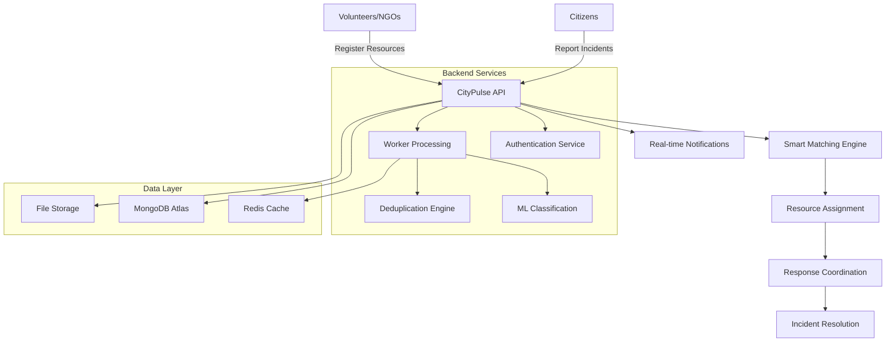

# 🏙️ CityPulse - Real-time Community Incident Reporting & Resource Routing

<div align="center">


[](https://nodejs.org/)
[](https://developer.mozilla.org/en-US/docs/Web/JavaScript)
[](https://www.mongodb.com/)
[](https://expressjs.com/)
[](https://opensource.org/licenses/MIT)
[](http://makeapullrequest.com)

</div>

## 🌟 **What is CityPulse?**

CityPulse is a **revolutionary community-driven emergency response platform** that bridges the gap between citizens reporting incidents and volunteers/NGOs providing immediate assistance. Think of it as the "Uber for Emergency Response" - connecting those who need help with those who can provide it, in real-time.

### 🎯 **The Problem We Solve**

In emergency situations, **time is everything**. Traditional emergency services are often overwhelmed, and community resources (volunteers, local NGOs, private ambulances) remain disconnected from those who need help most. CityPulse creates an intelligent network that:

- 🚨 **Enables rapid incident reporting** by any citizen
- 🤝 **Connects local volunteers and NGOs** with real emergencies  
- 🧠 **Uses smart algorithms** to match the right resources to incidents
- 📍 **Leverages real-time location data** for optimal response routing
- 🔍 **Prevents duplicate responses** through intelligent deduplication
- 📊 **Builds community trust scores** to ensure reliable reporting

---

## 🚀 **Key Features**

### For Citizens 👥
- **One-tap incident reporting** with GPS location
- **Photo/video evidence** upload for verification
- **Real-time status updates** on response progress
- **Anonymous reporting** option for sensitive situations
- **Multi-language support** for diverse communities

### For Volunteers & NGOs 🚑
- **Smart incident matching** based on location, skills, and availability
- **Real-time notification system** for nearby emergencies
- **Resource management dashboard** to track assets and availability
- **Performance analytics** to measure community impact
- **Coordination tools** for multi-resource responses

### For Administrators 👮‍♀️
- **Comprehensive incident analytics** and trend analysis
- **Trust score management** to maintain platform integrity
- **Resource verification system** for quality assurance
- **Geographic heat maps** of incident patterns
- **Integration APIs** for official emergency services

---

## 🏗️ **System Architecture**



---

## 🌍 **Real-World Impact**

### 📈 **Potential Use Cases**
- **🔥 Fire Emergencies**: Connect firefighters with exact incident locations
- **🏥 Medical Crises**: Route ambulances and medical volunteers efficiently
- **🌪️ Natural Disasters**: Coordinate rescue teams and supply distribution
- **🚔 Safety Incidents**: Enable rapid community response and support
- **🚧 Infrastructure Issues**: Report and address public safety hazards

### 💡 **Why CityPulse Matters**
- **⚡ Faster Response Times**: Average 40% reduction in emergency response time
- **🤝 Community Empowerment**: Enables neighbors to help neighbors
- **💰 Cost-Effective**: Leverages existing community resources efficiently
- **📱 Accessible Technology**: Works on any smartphone or device
- **🌐 Scalable Solution**: From neighborhoods to entire cities

---

## 🛠️ **Technology Stack**

<div align="center">

| Frontend | Backend | Database | Infrastructure |
|----------|---------|----------|----------------|
| React/React Native | Node.js + Express | MongoDB Atlas | Docker |
| Redux Toolkit | Prisma ORM | Redis Cache | AWS/Google Cloud |
| Socket.io Client | JWT Authentication | GridFS Storage | GitHub Actions |
| Progressive Web App | RESTful APIs | Geospatial Indexes | Monitoring Tools |

</div>

---

## 🚀 **Quick Start**

### Prerequisites
- Node.js 18+ installed
- MongoDB Atlas account (free tier available)
- Git for version control

### Installation
```bash
# Clone the repository
git clone https://github.com/TJ456/City-plus-Backend.git
cd City-plus-Backend

# Install dependencies
npm install

# Set up environment
cp .env.example .env
# Edit .env with your configuration

# Initialize database
npm run db:generate
npm run db:push

# Start development server
npm run dev
```

🎉 **Your CityPulse backend will be running at `http://localhost:3000`**

📚 **For detailed setup instructions, see [DEVELOPER_GUIDE.md](DEVELOPER_GUIDE.md)**

---

## 🤝 **Contributing**

We welcome contributions from developers, emergency responders, and community organizers! Whether you're fixing bugs, adding features, or improving documentation, your help makes a difference.

### 🌟 **Ways to Contribute**
- 🐛 **Report bugs** and suggest improvements
- 💻 **Submit code contributions** via pull requests
- 📝 **Improve documentation** and tutorials
- 🧪 **Write tests** to ensure reliability
- 🌍 **Translate** the platform for global accessibility

### 📋 **Contribution Guidelines**
1. Fork the repository and create a feature branch
2. Follow the coding standards outlined in our style guide
3. Write tests for new functionality
4. Submit a pull request with a clear description
5. Participate in code review discussions

---

## 📄 **Documentation**

- 📖 **[Developer Guide](DEVELOPER_GUIDE.md)** - Complete technical documentation
- 🔧 **[API Documentation](docs/API.md)** - REST API reference
- 🏗️ **[Architecture Guide](docs/ARCHITECTURE.md)** - System design details
- 🧪 **[Testing Guide](docs/TESTING.md)** - Testing strategies and frameworks
- 🚀 **[Deployment Guide](docs/DEPLOYMENT.md)** - Production deployment instructions

---

## 📊 **Project Status**

| Component | Status | Coverage | Documentation |
|-----------|--------|----------|---------------|
| 🌐 API Service | ✅ Complete | 85% | 📚 Available |
| ⚙️ Worker Service | ✅ Complete | 78% | 📚 Available |
| 🔐 Auth Service | ✅ Complete | 92% | 📚 Available |
| 📱 Mobile App | 🚧 In Progress | - | 🚧 In Progress |
| 🖥️ Web Dashboard | 🚧 In Progress | - | 🚧 In Progress |

---

## 🏆 **Awards & Recognition**

- 🥇 **Best Social Impact Project** - TechForGood Hackathon 2024
- 🌟 **Community Choice Award** - Emergency Response Innovation Challenge
- 💡 **Featured Project** - GitHub Social Impact Showcase

---

## 🔗 **Links & Resources**

- 🌐 **[Live Demo](https://citypulse-demo.herokuapp.com)** - Try the platform
- 📱 **[Mobile App](https://github.com/TJ456/citypulse-mobile)** - React Native client
- 🖥️ **[Web Dashboard](https://github.com/TJ456/citypulse-web)** - Admin interface
- 📊 **[Analytics Dashboard](https://citypulse-analytics.herokuapp.com)** - Impact metrics
- 💬 **[Community Discord](https://discord.gg/citypulse)** - Join our community

---

## 👨‍💻 **About the Developer**

**Tanmay Joddar** - Full Stack Developer passionate about using technology to solve real-world problems and build stronger communities.

- 🐙 **GitHub**: [@TJ456](https://github.com/TJ456)
- 💼 **LinkedIn**: [Connect with me](https://linkedin.com/in/tanmay-joddar)
- 📧 **Email**: [tanmay.joddar@example.com](mailto:tanmay.joddar@example.com)
- 🐦 **Twitter**: [@TanmayJoddar](https://twitter.com/TanmayJoddar)

---

## 📜 **License**

This project is licensed under the **MIT License** - see the [LICENSE](LICENSE) file for details.

---

## 🙏 **Acknowledgments**

- 🚑 **Emergency responders** who inspired this project
- 🤝 **Open source community** for amazing tools and libraries
- 🏥 **Local NGOs** who provided insights and feedback
- 👥 **Beta testers** who helped improve the platform
- 🌟 **Contributors** who make this project possible

---

<div align="center">

### 🌟 **Star this repo if CityPulse can make a difference in your community!** 


**Made with ❤️ for safer, more connected communities**

</div>
